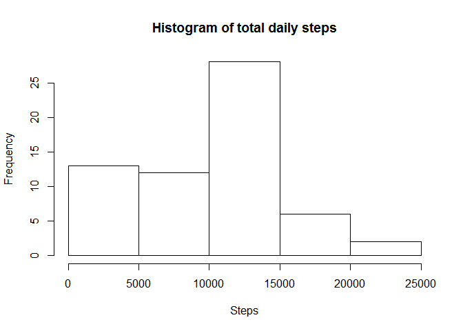
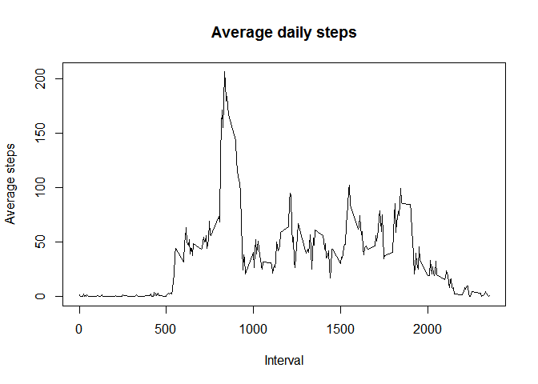
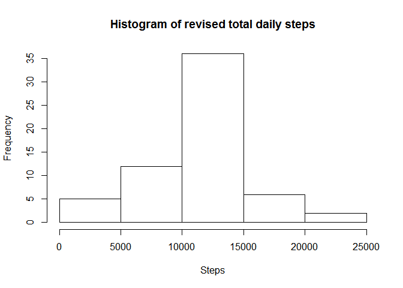
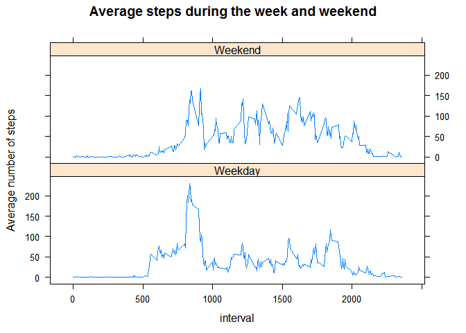

# Reproducible Research: Peer Assessment 1

#R Markdown document for Reproducible Research course project 1.

## Getting started

To work with R Markdown, if necessary:

* Install [R](http://www.r-project.org/)

* Install the lastest version of [RStudio](http://rstudio.org/download/)

* Install the latest version of the `knitr` package: `install.packages("knitr")`

### To run this specific example:

* Install `data.table` and 'lattice' packages: `install.packages("data.table")`;`install.packages("lattice")`

* Download the activity data and unzip manually. 
 
## Loading and preprocessing the data


```r
  library(data.table)
```

```
## Warning: package 'data.table' was built under R version 3.1.3
```

```r
  library(lattice)

  setwd('C:/Users/Starfish/Desktop/RepData_PeerAssessment1')
  data<-read.csv('activity/activity.csv')
  str(data)
```

```
## 'data.frame':	17568 obs. of  3 variables:
##  $ steps   : int  NA NA NA NA NA NA NA NA NA NA ...
##  $ date    : Factor w/ 61 levels "2012-10-01","2012-10-02",..: 1 1 1 1 1 1 1 1 1 1 ...
##  $ interval: int  0 5 10 15 20 25 30 35 40 45 ...
```

```r
  head(data)
```

```
##   steps       date interval
## 1    NA 2012-10-01        0
## 2    NA 2012-10-01        5
## 3    NA 2012-10-01       10
## 4    NA 2012-10-01       15
## 5    NA 2012-10-01       20
## 6    NA 2012-10-01       25
```

Variables included in this dataset are:  
steps: Number of steps taking in a 5-minute interval (missing values are coded as NA)  
date: The date on which the measurement was taken in YYYY-MM-DD format  
interval: Identifier for the 5-minute interval in which measurement was taken

## What is mean total number of steps taken per day? (ignoring the missing values in the dataset)  

### Histogram of the total number of steps taken each day


```r
  sum.dat<-data.table(data)[, list(tot=sum(steps, na.rm=TRUE)), by=date]
  hist(sum.dat$tot,main = 'Histogram of total daily steps', xlab = 'Steps')
```

 

### Mean and median total number of steps taken per day


```r
#Removes Scientific notations from labels
  opt<-options("scipen"=20)

  a<-round(mean(sum.dat$tot, na.rm=TRUE),0)
  b<-round(median(sum.dat$tot, na.rm=TRUE),0)
```

Mean steps per day: 9354  
Mediean steps per day: 10395

## What is the average daily activity pattern? (agian, ignoring the missing values in the dataset)

### Time series of average number of steps taken, averaged across all days

```r
  avg.dat<-data.table(data)[,list(avg=mean(steps, na.rm=TRUE)),by=interval]
  with(avg.dat, plot(interval,avg,type='l', main = 'Average daily steps', xlab='Interval', ylab='Average steps'))
```

 

### Which 5-minute interval, on average across all the days in the dataset, contains the maximum number of steps?

```r
  d<-avg.dat[avg==max(avg.dat$avg),]
```
On average, time interval 835 contains the greatest number of steps (206)

## Imputing missing values

Note that there are a number of days/intervals where there are missing values (coded as NA). The presence of missing days may introduce bias into some calculations or summaries of the data.

### Total number of missing values in the dataset

```r
  e<-nrow(data[is.na(data$steps),])
  f<-round(e/nrow(data) * 100,0)
```

Of the 17568there are 2304rows with missing step infromation, equating to 13percente of the dataset

These "NA" missing values will be filled in using the mean per time interval to create a new dataset equal to the original dataset but with the missing data filled in.

### New dataset 

```r
g<-merge(data, avg.dat)
g$steps[is.na(g$steps)]<-round(g$avg[is.na(g$steps)],0)
rev.dat<-g[,c('steps','date','interval')]
head(rev.dat)
```

```
##   steps       date interval
## 1     2 2012-10-01        0
## 2     0 2012-11-23        0
## 3     0 2012-10-28        0
## 4     0 2012-11-06        0
## 5     0 2012-11-24        0
## 6     0 2012-11-15        0
```

### Make a histogram of the total number of steps taken each day and Calculate and report the mean and median total number of steps taken per day. Do these values differ from the estimates from the first part of the assignment? What is the impact of imputing missing data on the estimates of the total daily number of steps?


```r
  sum.rev.dat<-data.table(rev.dat)[, list(tot=sum(steps, na.rm=TRUE)), by=date]
  hist(sum.rev.dat$tot,main = 'Histogram of revised total daily steps', xlab = 'Steps')
```

 

```r
  opt<-options("scipen"=20)
    #Removes Scientific notations from labels

  a.rev<-round(mean(sum.rev.dat$tot, na.rm=TRUE),0)
  b.rev<-round(median(sum.rev.dat$tot, na.rm=TRUE),0)

  # compared to the orginal values
  a-a.rev
```

```
## [1] -1412
```

```r
  b-b.rev
```

```
## [1] -367
```

The revised data gives 10766 mean steps per day, the same as the original data where "NA" values were excluded.   
The revised mediean steps per day (10762) is 3 steps per day less than the original median. 

## Are there differences in activity patterns between weekdays and weekends? (using the filled in dataset)


```r
  #rev.dat$weekday<- weekdays(as.Date(rev.dat$date))
    # - a check
  rev.dat$weekend<- as.factor(ifelse(weekdays(as.Date(rev.dat$date))%in%c('Saturday','Sunday'),'Weekend','Weekday'))
```

### Make a panel plot containing a time series plot of the average number of steps taken, averaged across all weekday days or weekend days. 


```r
  avg.rev.dat.week<-data.table(rev.dat)[,list(avg=mean(steps, na.rm=TRUE)),by=list(interval,weekend)]
  xyplot(avg~interval|weekend, data = avg.rev.dat.week,type='l',ylab= 'Average number of steps', main = 'Average steps during the week and weekend', layout = c(1, 2))
```

 

